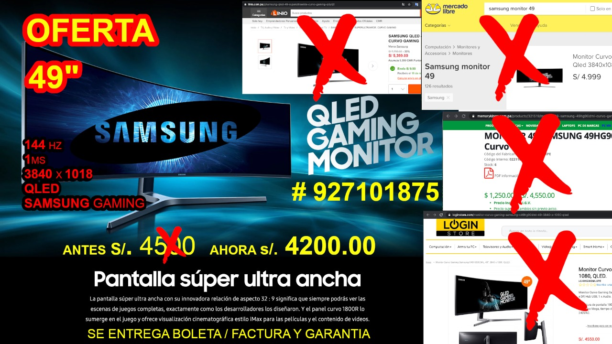

# Flyer-SamsungCHG90
> This is flyer for SamsungCHG90, The ultra-wide 49-inch screen with its innovative 32:9 aspect ratio means you always get to see game scenes in their entirety, exactly as their developers intended. And the 1800R curved panel immerses you in gameplay and delivers cinematic viewing for movies and video content..

## Built With

- GIMP 2.10

## Authors

👤 **Jasem Duncan Valencia Vargas**

- Github: [JasemDuncan](https://github.com/JasemDuncan)
- Linkedin: [Jasem-Duncan-Valencia](https://www.linkedin.com/in/jasem-duncan-valencia/)
- E-mail: [Jasem Valencia](jasemvalencia@gmail.com)

## 🤝 Contributing

Contributions, issues and feature requests are welcome!

Feel free to check the [issues page](issues/).

## Show your support

Give a ⭐️ if you like this project!

## Acknowledgments

- Hat tip to anyone whose code was used
- Inspiration
- etc

## 📝 License

This project is [MIT](lic.url) licensed.